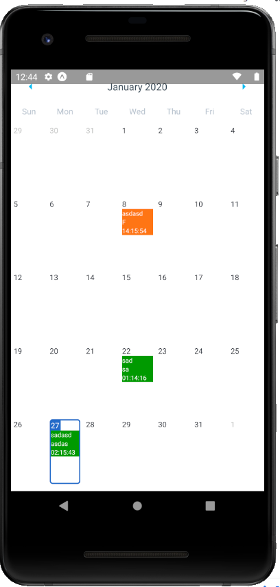

# Schedly

> Schedly is a calendar application built using React Native and Redux. It lets you add, edit and delete reminders.



## Requirements
- [npm](https://www.npmjs.com/get-npm)
- [NodeJS](https://nodejs.org/en/download/)

## Install dependencies
Open the project folder in a terminal and run the following command:
```shell
npm install
```

## How to Run the Project
Open the project folder in a terminal and run the following command:
```shell
npm start
```
You will need to have an Android/iOS emulator or download the Expo App on your phone to have fun with the App.
- [Google Play Store](https://play.google.com/store/apps/details?id=host.exp.exponent)
- [iOS AppStore](https://apps.apple.com/us/app/expo-client/id982107779)

You can get the emulators from:
- [Android](https://developer.android.com/studio/run/emulator)
- [iOS](https://developer.apple.com/library/archive/documentation/IDEs/Conceptual/iOS_Simulator_Guide/GettingStartedwithiOSSimulator/GettingStartedwithiOSSimulator.html)

## How to Run Unit Tests for the Create and Edit Reminder Functionality
The Unit Tests were developed using [Jest](https://jestjs.io/)
Open the project folder in a terminal and run the following command:
```shell
npm test
```
